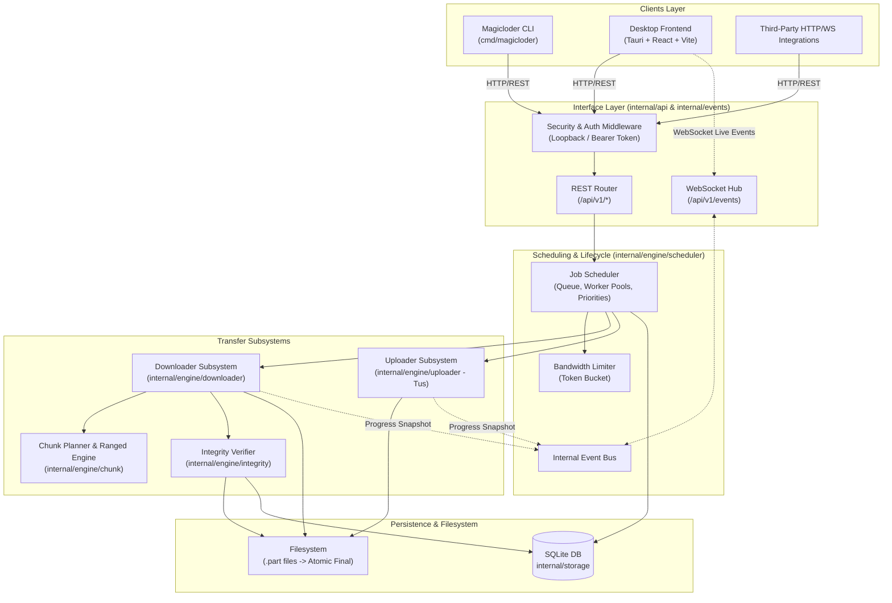

# Magicloder Architecture and Engineering Principles

## 1. System Overview

Magicloder is a production-grade, headless download and upload manager engineered in Go, accompanied by a decoupled desktop frontend built with Tauri, React, and TypeScript. It is designed to replace single-script download utilities with a resilient, concurrent, crash-safe transfer engine.

The system is split into two primary layers:
1. **The Headless Engine (`magicloder`)**: A self-contained background daemon exposing a local REST HTTP API (`/api/v1`) and real-time WebSocket event bus. It handles concurrency scheduling, chunk planning, ranged HTTP requests, Tus resumable uploads, atomic file finalization, and SQLite persistence.
2. **The Clients**: The command-line interface (CLI) and the Tauri desktop frontend. Both interact with the transfer engine strictly through the local API and WebSocket streams. Neither client ever accesses the storage database directly nor implements download/upload protocols.

---

## 2. Engineering Hierarchy of Needs

All engineering decisions in Magicloder follow a strict priority ordering:

```
1. Correctness
   └─► 2. Data Integrity
        └─► 3. Resumability
             └─► 4. Security
                  └─► 5. Observability
                       └─► 6. Performance
                            └─► 7. UI Polish
```

* **Correctness comes before speed.** Never optimize an unverified or fragile download path.
* **Data integrity is non-negotiable.** A completed file must match the source byte-for-byte. Partial files are isolated in `.part` files and never exposed as completed until validated.
* **Crash-safe resumability.** The daemon can be abruptly killed (SIGKILL, power failure) at any instant without corrupting state or forcing full re-downloads.
* **Security by default.** Loopback binding by default, strict URL scheme validation, SSRF protection against private IP access, and rigorous path traversal defenses.

---

## 3. High-Level Component Diagram



---

## 4. Module Boundaries & Public Interfaces

The codebase is organized with strict one-directional dependencies:

```
cmd/magicloder
  └─► internal/api, internal/events, internal/config
        └─► internal/engine/scheduler
              ├─► internal/engine/downloader
              │     ├─► internal/engine/chunk
              │     ├─► internal/engine/integrity
              │     └─► internal/security
              ├─► internal/engine/uploader
              │     └─► internal/security
              └─► internal/storage
                    └─► internal/model
```

### Module Responsibilities

1. **`internal/model`**:
   - Contains pure domain entities: `Download`, `Chunk`, `Upload`, `DownloadStatus`, `ChunkStatus`, `UploadStatus`.
   - Defines pure state machines and valid transitions.
   - Zero external imports; completely decoupled from HTTP, SQLite, or UI logic.

2. **`internal/storage`**:
   - Manages SQLite persistence and schema migrations (`migrations/`).
   - Implements repositories (`DownloadRepository`, `ChunkRepository`, `UploadRepository`).
   - Batches progress updates to disk without writing on every byte read.

3. **`internal/engine/chunk`**:
   - Implements the chunk partitioner (`PlanChunks(totalSize, workerCount, minChunkSize)`).
   - Validates HTTP `Range` headers and `Content-Range` response headers (verifying `206 Partial Content`, bounds, and payload sizes).

4. **`internal/engine/downloader`**:
   - Probes target URLs (using `HEAD` with safe `GET` fallback).
   - Executes multi-connection ranged downloads using `os.File.WriteAt` into isolated `.part` files.
   - Automatically detects broken range servers and falls back to single-stream downloading.
   - Implements bounded exponential backoff retries for transient HTTP errors.

5. **`internal/engine/uploader`**:
   - Completely independent from the download engine.
   - Implements Tus 1.0.0 protocol (`POST` creation, `HEAD` offset query, `PATCH` chunk upload).
   - Reads files as streaming bounded buffers to prevent memory spikes.

6. **`internal/engine/scheduler`**:
   - Manages transfer job queues, worker concurrency caps, and task priorities.
   - Controls transitions (`Queued`, `Probing`, `Downloading`, `Paused`, `Completed`, `Failed`, `Cancelled`).
   - Throttles global and per-task bandwidth using token-bucket rate limiting.

7. **`internal/engine/integrity`**:
   - Computes and verifies SHA-256 / MD5 digests against expected values.
   - Enforces atomic file finalization (`rename(temp.part, final)`).

8. **`internal/security`**:
   - Sanitizes untrusted filenames from URLs and `Content-Disposition`.
   - Prevents path traversal (`../`, absolute paths, null bytes, Windows reserved device names).
   - Validates IP addresses to prevent Server-Side Request Forgery (SSRF) against private networks and loopback targets.

9. **`internal/api` & `internal/events`**:
   - Exposes REST endpoints at `/api/v1/*` conforming to OpenAPI 3.0 specifications.
   - Manages an in-memory WebSocket event broadcaster that buffers metrics and streams tick-based snapshots (default: 500ms) without blocking workers.

10. **`frontend/desktop`**:
    - Tauri v2 + React 18 + TypeScript + Vite.
    - Consumes the local HTTP API and WebSocket events.
    - Handles reconnections with state reconciliation. Contains no download or SQLite logic.

---

## 5. Core Operational Invariants

1. **File Safety**:
   - Every download writes to `[filename].[id].part`.
   - An unfinished file is never named with its final destination path.
   - Finalization verifies exact byte count and checksum before an atomic rename.
2. **Crash Resilience**:
   - Chunks maintain persisted `start_byte`, `end_byte`, and `completed_bytes`.
   - On daemon startup, active jobs are recovered from SQLite, remote resources are re-probed (checking ETag and Last-Modified), and partial chunk offsets are reconciled.
3. **Bounded Resources**:
   - Memory per connection is strictly bounded (fixed buffer pool, e.g., 32 KiB chunks).
   - Uploads and downloads stream directly between disk and socket without buffering entire payloads in RAM.
4. **Decoupled Clients**:
   - Neither CLI nor Tauri interacts with the SQLite database directly. All operations pass through the API layer.

---

## 6. Supported Platforms & Release Targets

| Platform | Architecture | Daemon Support | Desktop GUI Support | Tier |
|---|---|---|---|---|
| **Linux** | x86_64 (`amd64`) | Yes | Yes (GTK3 / WebKitGTK) | Tier 1 |
| **Linux** | ARM64 (`arm64`) | Yes | Yes | Tier 1 |
| **macOS** | Apple Silicon (`arm64`) | Yes | Yes (WKWebView) | Tier 1 |
| **macOS** | Intel (`amd64`) | Yes | Yes (WKWebView) | Tier 1 |
| **Windows** | x86_64 (`amd64`) | Yes | Yes (WebView2) | Tier 1 |

---

## 7. Roadmap by Phases

- **Phase 0**: Architecture and core principles specification.
- **Phase 1**: Go project skeleton, CLI entrypoint, and config foundation.
- **Phase 2**: HTTP probing, single-stream download engine, and file safety.
- **Phase 3**: Chunk planner, HTTP range validator, and multi-connection engine.
- **Phase 4**: SQLite persistence, chunk state tracking, and crash-safe reconciliation.
- **Phase 5**: Scheduler, state machine, pause/resume/cancel, and token-bucket rate limiter.
- **Phase 6**: Resumable Tus uploader with bounded streaming memory.
- **Phase 7**: Secure localhost HTTP REST API (`/api/v1`) with OpenAPI 3.0 spec.
- **Phase 8**: Real-time WebSocket event broadcaster and metric aggregation.
- **Phase 9**: Tauri + React + TypeScript desktop application.
- **Phase 10**: Security hardening (SSRF guard, path traversal defense, origin validation).
- **Phase 11**: Integrity verification, SHA-256 validation, and atomic finalization.
- **Phase 12**: Observability, structured logging, diagnostics, and transfer benchmarks.
- **Phase 13**: Headless CLI commands (`serve`, `add`, `list`, `info`, `pause`, etc.).
- **Phase 14**: Packaging, GitHub Actions CI/CD matrix, release automation.
- **Phase 15**: HTTP compatibility matrix and edge-case integration test suite.
- **Phase 16**: Remote-server mode with token authentication and CORS protection.
